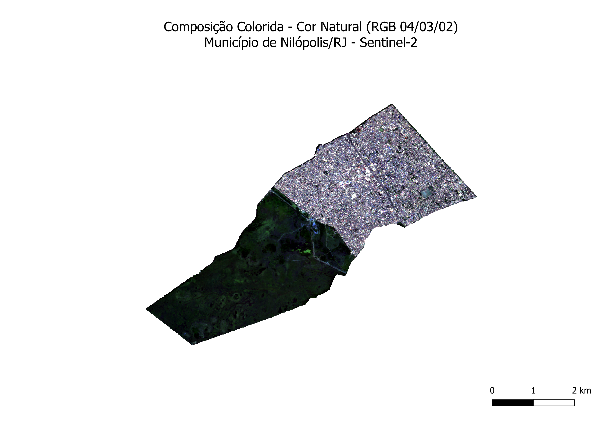
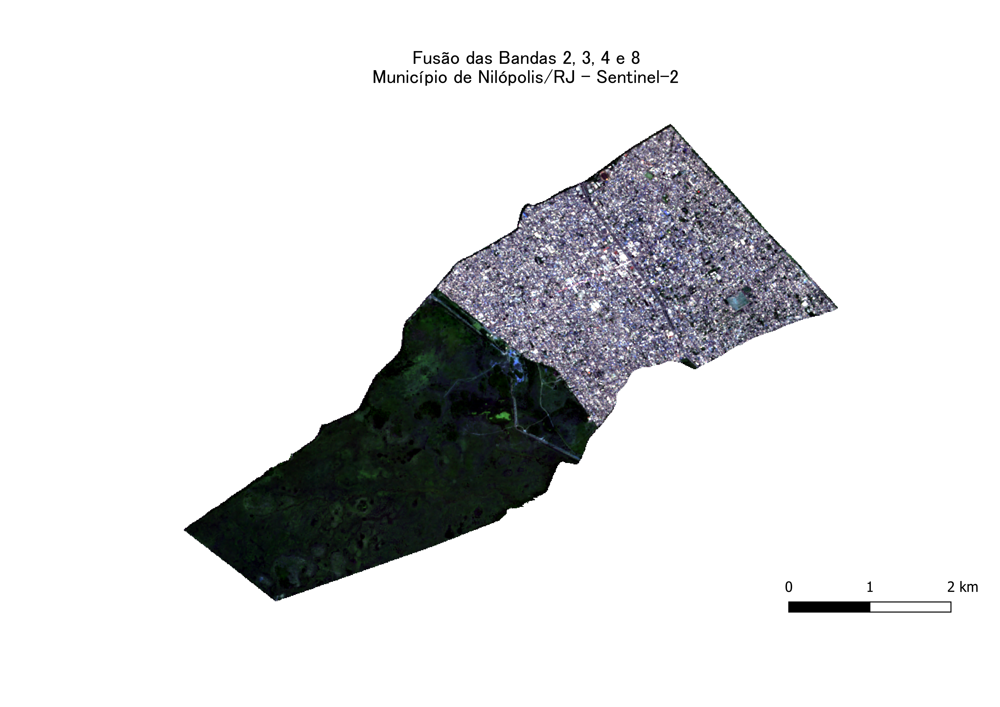
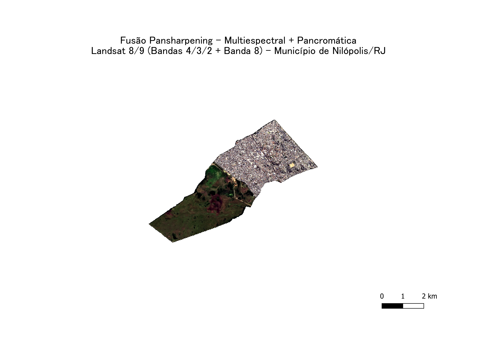
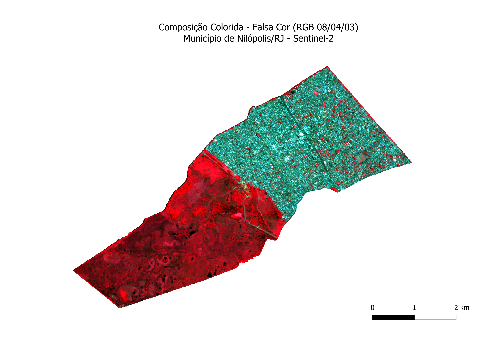

# Processamento de Imagens de Satélite — Município de Nilópolis/RJ

## Contexto

Atividade avaliativa da disciplina Sensoriamento Remoto I, cursada na especialização em Análise Ambiental e Gestão de Territórios (ENCE/IBGE). A atividade consistiu na geração de composições coloridas e fusão de imagens de satélite aplicadas a um município à escolha, aqui Nilópolis/RJ — mesmo município do TCC de graduação do autor, ["Diagnóstico do ICMS Ecológico no Município de Nilópolis/RJ"](https://petrus.cp2.g12.br/handle/123456789/4169).

## Metodologia

- **Bandas Sentinel-2** (B02, B03, B04, B08), processadas em QGIS
- **Bandas Landsat 8/9** (4/3/2 + banda 8 pancromática)
- **Composições geradas:**
  - Cor natural (RGB 04/03/02)
  - Falsa cor (RGB 08/04/03)
  - Fusão pansharpening (multiespectral + pancromática, Landsat)
  - Mapa de infraestrutura complementar

## Conteúdo do repositório

- `Avaliacao01_Nilopolis.qgz` — projeto QGIS completo, com camadas e composições configuradas
- `NIL_B02.tif`, `NIL_B03.tif`, `NIL_B04.tif`, `NIL_B08.tif` — bandas brutas Sentinel-2
- `NIL_RGB.tif`, `NIL_FUSAO.tif`, `NIL_INFRA.tif` — composições processadas
- `Nilopolis_RGB.png`, `Nilopolis_FUSAO.png`, `Nilopolis_FUSAO_LANDSAT.png`, `Nilopolis_INFRA.png` — resultados finais

## Resultados

### Composição colorida — Cor natural (RGB 04/03/02)

### Composição colorida — Falsa cor (RGB 08/04/03)

### Fusão pansharpening — Landsat 8/9

### Mapa de infraestrutura

